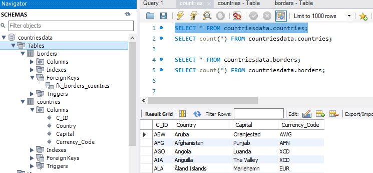
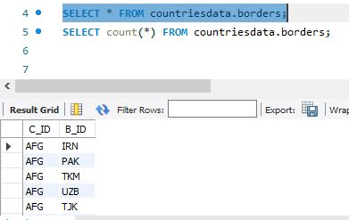

# frame-dependency-api project
This is the parent project of the application test project. It contains all the methods and functionality of the follwoing: -
1) mysql-jdbc connections (insert/update/delete/retireve)
2) rest-api (setupurl/setParam/setHeaders/HitRequest/verifyReponseCode/verifyResponse).
3) ExtentReport methods (startReport/startTest/reportStep/endTest/endReport)
<br><br>
**Run Command**: -
>mvn clean install
<br><br>

This project is used mainly for 2 purposes: -
1) The 3 main classes (JdbcConnection/RestAPIClient/ReporterClass) are used for the re-usable methods in any application test project with the help of following dependency: -<br>

```
<dependency>
  <groupId>com.geminisols</groupId>
  <artifactId>frame-dependency-api</artifactId>
  <version>1-SNAPSHOT</version>
</dependency>
  ```
2) The 3 test classes is used to test all the methods defined in the 3 main classes and the data is given for the testing in such a way as it is setting-up the MySql Db tables i.e countries and borders, as it is mentioned in the requirement.
<br>**Note**: - Here, all Delete(set table to empty in beginning), Insert (Insert all rows in both the table), Update(Updaing few records) are made through JDBC connection as per the requirement document.

<div align="Left">
     
</div>
<br>
<div align="Left">
     
</div>
