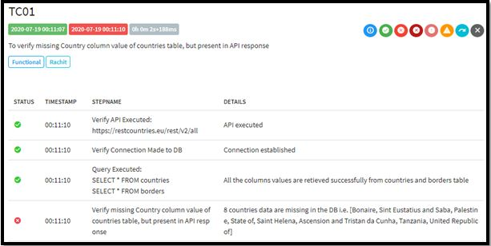
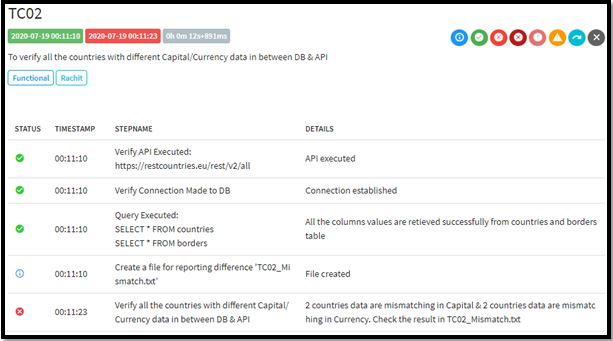
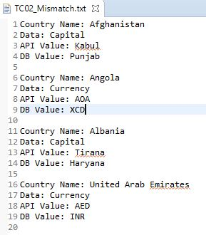
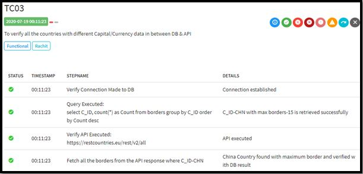
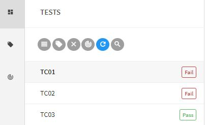
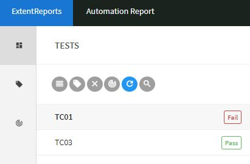
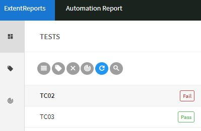

# countries-test-automation project
This is the child project of the frame-dependency-api project. 
  
**Run Command**: -
>mvn generate-resources test
  

It contains all the test scripts TC01, TC02 and TC03 using the parent main classes. 
1) TC01 test script output 

     

 
2) TC01 test script output 

     

     

 
3) TC01 test script output 

     

  Other than these, it also comprises the 2 main classes: -  
1) **Launcher java** 
 a) It intilizes the config.properties file, which is working like TestSuite file. 
 b) Here is also a code to generate run time testng.xml which contains only those classes which are available in config file. **generate-resources** is the maven goal to generate testng.xml.
 c) And finally we are running that testng file.**test** is the maven goal to run testng.xml.
  
2) **TestBase.java**
 a) It is a place to initialize all the main classes object of the parent object and finally used a parent class for all the Test Script classes.
 b) Constructor is used to hit the https://restcountries.eu/rest/v2/all API and run some queries to get the values in api & db variables.
 c) @BeforeSuite and @AfterSuite testng annotation are also give here.
  

**Report output of the following 3 test cases as per the configuration, shown below**: - 

     

     

     

 
